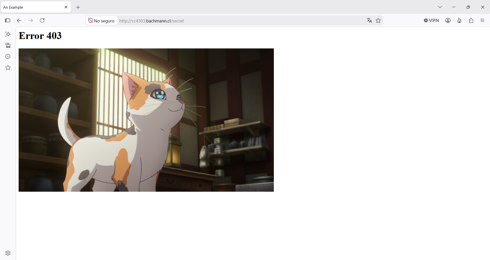
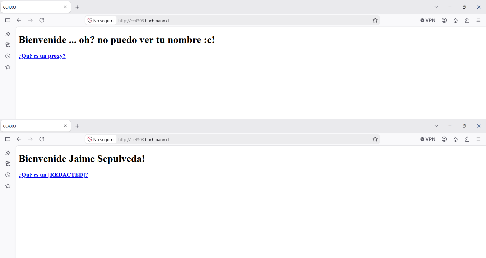
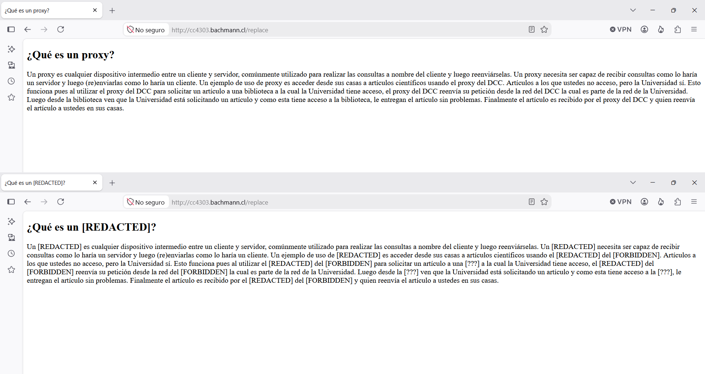

# CC4303-C1

# Informe parte 1: Construcción de un Proxy

Integrantes: César Barrueto, Jaime Sepúlveda
Fecha: 07/09/2026
Profesora: Ivana Bachmann.
Auxiliar: Julián Ferreira

Enlace de github: https://github.com/Jaimewol12/CC4303-C1

Disclaimer uso de IA (ChatGPT-5.6):
- Se utilizó IA para solucionar problemas de conexión entre el navegador de Windows y la máquina virtual. Se descubrió que era necesario cambiar la configuración de red "NAT" por "Adaptador puente" en la máquina virtual.
- También se utilizó para investigar cómo solucionar problemas de peticiones no solicitadas hechas desde Microsoft Edge y Google Chrome al proxy, o para evitar la transformación automática de "http://..." a "https://" que hacen esos navegadores. Con ayuda de la profesora, la mejor solución fue utilizar Mozilla Firefox para evitar esos problemas. Todos los experimentos de este informe fueron hechos en Mozilla Firefox.

## La estructura de datos HttpContent

### Campos de HttpContent

Para almacenar eficientemente la información de un mensaje HTTP, se implementó la estructura HttpContent con los siguientes campos:

- version: Un float que almacena la versión del protocolo HTTP utilizado por el mensaje. Para esta tarea, la versión siempre fue 1.1.
- head: Un diccionario de strings que contiene todos los headers del mensaje HTTP.
- body: El área de datos (en bytes) del mensaje HTTP. Este valor puede ser la cadena de bytes vacía b"".
- type: Una instancia de la clase RequestHttp o la clase ResponseHttp. Dependiendo de la clase, este campo representa si el mensaje es una request o una respuesta.

### La clase RequestHttp

Contiene dos campos para guardar la información de la "start line" de un mensaje HTTP del tipo REQUEST:
- method: Un string que indica el método que está usando el mensaje HTTP. Por ejemplo: GET, POST o HEAD.
- route: Un string que indica la dirección del recurso solicitado.

En esta tarea, solamente se utilizó RequestHTTP para representar las peticiones realizadas por el cliente o el navegador del cliente. Por lo tanto, el campo "method" siempre tuvo el valor GET.

### La clase ResponseHttp

Contiene dos campos para guardar la información de la "start line" de un mensaje HTTP del tipo RESPONSE:
- code: El código del estado de la respuesta. Por ejemplo: 200 o 403
- status: El texto asociado al estado de la respuesta. Por ejemplo, si "code = 200", entonces "status" es igual a "OK".

Estos campos le permiten al proxy devolver el código de error 403 al momento de entrar a una página prohibida.

### Decisiones de diseño

El campo "version" se repite en ambos tipos de mensajes. Por esa razón es un campo de HttpContent en lugar de ser parte de RequestHttp o ResponseHttp.

El uso de diccionarios para almacenar los headers es muy útil, ya que todos los headers están escritos de la forma "Key: Value". Un ejemplo es: "Host: www.example.com". Además, los headers no tienen un orden definido, así que no es necesario usar estructuras que conserven el orden al momento de almacenarlos.

Nuestro proxy debe filtrar las palabras prohibidas de cualquier página HTML, así que debe ser capaz de revisar el BODY de un mensaje HTTP. En ese caso, sería útil almacenar el campo "body" como string. Sin embargo, el campo "body" se mantiene en bytes para recordar que el BODY de un mensaje HTTP no se debería leer, por temas de privacidad. Sin embargo, este riesgo de romper la privacidad no aplica para los headers, por eso se almacenan como strings.

## La función parse_HTTP_message(http_message: bytes)

Esta función se encarga de leer un mensaje HTTP y transformarlo en una instancia de la clase HttpContent.

### ¿Qué debería extraer la función parse?

Se deben extraer los headers del mensaje, la versión del protocolo HTTP que se usa, el BODY del mensaje, y la información almacenada en la "start line".
En la "start line", si el mensaje es del tipo REQUEST, entonces se debe extraer la ruta y el método (GET, POST, etc.) que utiliza el mensaje HTTP. Si es del tipo RESPONSE, entonces se extrae el código del estado de la respuesta y el texto asociado al estado.

### Implementación

Se sabe que la sección del HEAD de un mensaje HTTP empieza al inicio del mensaje y termina cuando se escribe "\r\n\r\n". Por lo tanto, lo primero que hace la función es buscar la posición de la cadena de bytes b"\r\n\r\n" dentro del mensaje. Esto nos permite saber dónde termina el HEAD del mensaje y dónde empieza el BODY.

Con la ubicación del HEAD encontrada, se transforma la sección del HEAD en un string usando decode(). Posteriormente, se utiliza splitlines() para separar cada línea del HEAD. La primera línea representa la "start line" y nos permite identificar si el mensaje HTTP es del tipo REQUEST o RESPONSE.

Si en los primeros cuatro caracteres de la "start line" aparece "HTTP", entonces es un mensaje del tipo RESPONSE y el resto de la primera línea contiene la versión del protocolo HTTP del mensaje junto con el código del estado de respuesta y su texto asociado. De lo contrario, el mensaje es del tipo REQUEST y en la primera línea se encuentra el método usado, la ruta a la que se dirige el mensaje, y la versión del protocolo HTTP.

El resto de líneas de la sección del HEAD contienen los headers del mensaje. Cada línea es un header diferente, escrito de la forma "Key: Value". Estos headers son almacenados dentro de un diccionario. Por otro lado, el BODY se conserva sin ser revisado, pues solamente importa conocer la posición donde inicia (después de "\r\n\r\n") y termina (al final del archivo).

Finalmente, se crea una instancia HttpContent con la versión del mensaje, el diccionario de headers, el BODY intacto, y una instancia de la clase RequestHttp o la clase ResponseHttp con la información de la "start line" dependiendo del tipo del mensaje.

## La función create_HTTP_message(http_structure: HttpContent)

Esta función recibe una instancia de la estructura HttpContent y la transforma en un mensaje HTTP en bytes.

### Implementación

Primero construye un string con la información de la "start line". Si el campo "type" de HttpContent tiene una instancia de la clase RequestHTTP, entonces la "start line" se escribe de la siguiente forma:

```
http_message = f"{http_structure.type.method} {http_structure.type.route} HTTP/{http_structure.version}\r\n"
```

De lo contrario, si es una instancia de la clase ResponseHTTP, entonces la "start line" se arma de la siguiente forma:

```
http_message = f"HTTP/{http_structure.version} {http_structure.type.code} {http_structure.type.status}\r\n"
```

Posteriormente se lee el diccionario de headers con un bucle *for*, y se van agregando uno a uno al string "http_message", recordando incluir un "\r\n" entre cada header para cumplir el protocolo HTTP.

```
for header, value in http_structure.head.items():
  http_message += f"{header}:{value}\r\n"
```

Después de leer todos los headers, se agrega otro "\r\n" para indicar que la sección del HEAD está completa. Solamente falta transformarlo a bytes usando encode(), y luego se agrega el campo "body" al final del mensaje "http_message". Tras realizar todo ese proceso, se tradujo correctamente un mensaje HTTP en bytes usando una instancia de HttpContent.

La función create_HTTP_message es la función inversa de parse_HTTP_message.

## La función receive_and_parse_full_message(connection_socket: socket, buff_size: int)

Le permite a un socket del proxy recibir un mensaje HTTP y transformarlo en una instancia de HttpContent. Esta función se asegura de recibir el mensaje completo. Para lograrlo, la diseñamos de la siguiente forma:

### Implementación

Primero el socket ejecuta:
```
http_message: bytes = connection_socket.recv(buff_size)
```

Luego revisa si "http_message" contiene la cadena de bytes b"\r\n\r\n". Esto nos permite identificar si ya se han recibido todos los headers del mensaje. De lo contrario, el mensaje está incompleto.
```
while b"\r\n\r\n" not in http_message:
  http_message += connection_socket.recv(buff_size)
```

Al reconocer la cadena b"\r\n\r\n", significa que la función ya ha recibido todos los headers del mensaje HTTP. Sin embargo, es posible que el BODY del mensaje esté incompleto. Para solucionar esto, sabemos que el header "Content-Length" nos entrega el largo del BODY. Entonces solamente es necesario comparar el valor de "Content-Length" con el largo del BODY que hemos recibido. No obstante, aún no hemos parseado el mensaje, por lo tanto no sabemos cuál es el valor de "Content-Length" ni cuál es largo del BODY que hemos recibido.

Afortunadamente, podemos utilizar nuestra función parse_HTTP_message sin importar que el BODY esté incompleto, ya que esa función acepta BODYs de cualquier largo, pues nunca los revisa. A esa función solamente le importa que la sección HEAD del mensaje haya sido recibida completamente.

```
http_struct: HttpContent = parse_HTTP_message(http_message)
```

Una vez hemos parseado el mensaje en una instancia de la clase HttpContent, podemos revisar que el valor del header "Content-Length" sea igual al tamaño del campo "body" de nuestra instancia. De lo contrario, el socket debe seguir recibiendo el BODY del mensaje HTTP y añadirlo al campo "body" de la estructura.

```
if "Content-Length" in http_struct.head:
  while len(http_struct.body) < int(http_struct.head["Content-Length"]):
    http_struct.body += connection_socket.recv(buff_size)
```

El motivo del "if" es que existen mensajes HTTP con la sección del BODY vacía (por ejemplo, una REQUEST del navegador), entonces no es necesario que el mensaje incluya el header "Content-Length", pues su valor sería cero. Si no encontramos el header "Content-Length", entonces se asume que el BODY del mensaje está vacío y solo es importante asegurar que se han recibido todos los headers.

Finalmente, se retorna la instancia de la clase HttpContent con toda la información extraída de un mensaje HTTP.

## La función proxy_http_request(http_struct: HttpContent, buff_size: int)

Esta es la función encargada de comunicar el request del cliente al servidor de destino por medio del proxy.

### ¿Cómo se puede obtener la dirección del servidor a la que quiere llegar el cliente?

Podemos obtener la dirección (IP, puerto) del servidor al revisar el valor del header "Host" que se encuentra en el REQUEST del cliente.

### Implementación

Se obtiene la dirección (en forma de string) usando el valor del header "Host". Luego, se utiliza lstrip() para remover el espacio vacío en el extremo izquierdo del string.
```
client_request_address: str = http_struct.head["Host"].lstrip()
```

Solamente nos interesa la IP, ya que el puerto de las páginas web en esta actividad se asume que es 80.

```
ip_to_connect: str = client_request_address.split(":")[0]
destination_address: tuple = (ip_to_connect, 80)
```

Ahora se crea un nuevo socket (orientado a conexión) para crear un canal de comunicación entre el proxy y el servidor de destino.
```
socket_for_destination = socket.socket(socket.AF_INET, socket.SOCK_STREAM)
socket_for_destination.connect(destination_address)
```

Por petición del enunciado, se agrega el header "X-ElQuePregunta" al mensaje HTTP antes de enviarlo al servidor.

```
http_struct.head["X-ElQuePregunta"] = "Jaime Sepulveda"
http_message_to_destination: bytes = create_HTTP_message(http_struct)
socket_for_destination.send(http_message_to_destination)
```

Luego, se recibe el mensaje entregado por el servidor de forma completa (usando nuestra función definida anteriormente) y se cierra el socket.

```
http_struct_from_server: HttpContent = receive_and_parse_full_message(socket_for_destination, buff_size)
socket_for_destination.close()
return http_struct_from_server
```
## La función create_forbidden_page_response(version: float = 1.1)

Se encarga de construir el mensaje HTTP con el HTML que representa una página bloqueada. Para lograr esto, resulta mucho más fácil empezar con una instancia de la clase HttpContent, entregarle la información que queremos incluir en el mensaje, y luego transformar HttpContent a bytes.

Esta es una respuesta al cliente y su código de error es 403. La versión del protocolo HTTP es un parámetro recibido por la función.
```
http_response_status: ResponseHttp = ResponseHttp(403, "Forbidden")
version: float = version
```

El BODY del mensaje HTTP será el HTML de la página bloqueada, entonces se debe añadir el header "Content-Type" con el valor "text/html; charset=UTF-8"
```
head: dict[str, str] = {'Content-Type': 'text/html; charset=UTF-8'}
```

Luego se crea la variable "body". En esta variable se escribe el HTML que se desea enviar. Posteriormente, se añade el header "Content-Length" al diccionario de headers y su valor será el largo del HTML.
```
head['Content-Length'] = len(body)
```

Finalmente, con todas las variables definidas, se crea una instancia de la clase HttpContent y se transforma a bytes.
```
http_struct: HttpContent = HttpContent(http_response_status, version, head, body=body)
http_message_to_client: bytes = create_HTTP_message(http_struct)
return http_message_to_client
```

## Otras funciones importantes del proxy:

### is_forbidden_adress(http_client_request: HttpContent, json_file: str)

Compara el campo "route" de una instancia de HttpContent (del tipo REQUEST) con las direcciones prohíbidas dentro del archivo "json_file". Retorna True si la ruta es una dirección prohíbida.

### create_forbidden_image_response(version: float = 1.1)

Construye el mensaje HTTP con la imagen de un gato y el código de error 403. Esta función realiza un trabajo similar a la función create_forbidden_page_response, pero en este caso el campo "body" posee los bytes de una imagen, y el valor del header "Content-Type" es "image/png", ya que se está enviando una imagen en lugar de texto.

### replace_forbidden_words(http_struct: HttpContent, json_file: str)

Esta es la función que lee el campo "body" de una instancia de HttpContent y reemplaza todas las palabras prohibidas por las palabras definidas en el archivo "json_file". Retorna la misma instancia HttpContent pero con su campo "body" filtrado y el valor del header "Content-Length" actualizado.

## Funcionamiento del proxy

Dentro del archivo donde fue implementando el proxy, existen variables para modificar el tamaño del buffer de los sockets, y especificar la dirección (IP, puerto) del socket principal del proxy.

Se bindea el socket principal del proxy a la dirección especificada, y luego se ejecuta un bucle while infinito para recibir cualquier petición del cliente. Al momento de detectar una petición, se utiliza la función accept() para crear un nuevo socket que se comunicará con el cliente. Posteriormente se utiliza la función receive_and_parse_full_message para recibir el mensaje HTTP completo del cliente.

Para evitar problemas con peticiones externas del navegador, se descartan todos las peticiones que usen el método CONNECT (se utiliza con el protocolo https).

Después se revisa a qué dirección se quiere dirigir el cliente. Si desea obtener la imagen del gato, entonces se envía el mensaje HTTP de la imagen con ayuda de la función create_forbidden_image_response. De lo contrario, se revisa si la dirección es una dirección prohibida utilizando is_forbidden_adress.

Si la dirección es prohibida, entonces se debe enviar nuestro HTML construido por la función create_forbidden_page_response. Si la dirección no es prohibida, entonces se le agrega el header "X-ElQuePregunta: Jaime Sepulveda" al mensaje HTTP del cliente y se envía el servidor de destino usando proxy_http_request. Luego, la misma función proxy_http_request devuelve la respuesta completa del servidor. Solamente falta filtrar la respuesta usando replace_forbidden_words, y finalmente se envía al cliente.

## Diagrama de flujo del proxy

Explicado en palabras, el proxy necesita a lo más tres sockets.

1. El socket principal es que el escucha las peticiones de cualquier cliente que quiera conectarse al proxy, por ejemplo, un navegador.
2. Cuando el proxy recibe una petición, se crea un socket específico para comunicarse con el cliente (socket cliente-proxy) y recibir el mensaje HTTP del cliente.
3. El proxy crea un tercer socket (proxy-servidor) para comunicarse con el servidor de destino y enviarle el mensaje HTTP.
4. El socket proxy-servidor recibe el mensaje de respuesta del servidor. Se cierra ese socket.
5. El proxy le envia el mensaje de respuesta del servidor al cliente por medio del socket cliente-proxy.
6. Se termina el proceso y se cierra el socket cliente-proxy.

## ¿Cómo ejecutar el servidor proxy?

Para iniciar el proxy, es necesario definir las variables de entorno que dictan la IP y el puerto de escucha. Por defecto, el sistema utilizará la IP '_localhost_' y el puerto _8000_ si no se especifican.

En su archivo .env (o modifique .env.example), debe poner lo siguiente:
```
SERVER_HOST= Acá pueden poner la IP de la máquina virtual donde se ejecuta el proxy
SERVER_PORT= Acá pueden poner el puerto que necesitan (por defecto 8000)
```

De todas formas, si no se tiene el módulo dotenv (se puede instalar usando _pip install python-dotenv_), o no puede crear un archivo .env, se puede modificar la siguiente línea de código para poner la IP que se necesite.

```python
proxy_ip: str = os.getenv('SERVER_HOST','Acá pueden poner la IP que necesiten sin utilizar la librería dotenv')
proxy_port: int = int(os.getenv('SERVER_PORT', Acá puede poner el puerto que necesiten sin utilizar la libería dotenv))
```

Finalmente basta dejar en ejecución el proxy ejecutando el archivo _tcp_proxy_server.py_ desde la máquina virtual. Luego configura su navegador para conectarse al proxy.

## Respuestas a las preguntas sobre el tamaño del buffer

### ¿Cómo sé que el HEAD llegó completo?

Al momento de leer el mensaje HTTP en bytes, si se detecta la cadena b"\r\n\r\n", entonces sabemos que hemos recibido completamente el HEAD del mensaje.

### ¿Qué pasa si los headers no caben en mi buffer?

El socket del proxy que está recibiendo el mensaje debe ejecutar varias veces la función recv() para obtener el resto del mensaje HTTP. Cuando el fragmento del mensaje recibido incluya la cadena b"\r\n\r\n", entonces hemos recibido todos los headers.
 
### ¿Cómo sé que el BODY llegó completo?

Usando la función len() se puede calcular el largo del BODY. Si el largo del BODY es el mismo que el valor almacenado en el header "Content-Length", entonces se ha recibido la totalidad del BODY.
Si el mensaje HTTP no incluye el header "Content-Length", entonces no es necesario preocuparse del BODY, se asume que está vacío.

### ¿Cómo sé si llegó el mensaje completo?

Si la totalidad del HEAD y del BODY ha sido recibida, entonces sabemos que el mensaje ha llegado completamente.

## Pruebas

### Error 403

Al usar el proxy e ingresar a la página http://cc4303.bachmann.cl/secret, el navegador recibe un código de error 403 junto a un HTML con la imagen de un gato.



#### ¿Cuántos ciclos de comunicación HTTP son necesarios para mostrar una imagen en un navegador?

Para mostrar la imagen de la página prohibida, el navegador realiza una petición al servidor para que le envíe la imagen. Luego, el proxy intercepta la petición y crea un nuevo socket para establecer el canal de comunicación entre el navegador y el proxy. Posteriormente, el proxy envía la imagen al navegador con ayuda de la función create_forbidden_image_response. En ningún momento se abrió un canal de comunicación entre el proxy y el servidor, únicamente se utilizó un ciclo de comunicación entre el navegador y el proxy.

### Modificación de palabras y filtrado de palabras

En la siguiente imagen se muestran dos fotos del sitio http://cc4303.bachmann.cl/. La captura de la parte superior muestra como se ve el sitio al acceder de forma normal (sin usar el proxy). Mientras que la foto de la parte inferior muestra cómo se ve el sitio al acceder mediante el proxy. Se puede ver que al usar el proxy, aparece el nombre "Jaime Sepulveda" en la página web. Esto se logra gracias a que el proxy añade el header "X-ElQuePregunta: Jaime Sepulveda" al mensaje HTTP que viaja al servidor. Por otro lado, también se aprecia que la palabra prohibida proxy fue reemplazada por [REDACTED].



Un mejor ejemplo de filtrado de palabras se aprecia al acceder al sitio http://cc4303.bachmann.cl/replace. La imagen de abajo muestra dos fotos de ese sitio. En la parte superior se muestra cómo se ve el sitio web al acceder de forma normal (sin proxy), mientras que en la parte inferior se muestra la vista del sitio web usando el proxy. Se puede ver que una gran cantidad de palabras fue reemplazada.



### Experimentando con tamaños de buffer diferentes

#### El buffer es de menor tamaño que el mensaje, pero es más grande que el área de headers

Para observar esto, se impuso "buff_size = 256" para que el tamaño del buffer solo sea de 256 bytes. Posteriormente se ingresó al sitio http://cc4303.bachmann.cl/replace que tiene cerca de 1000 caracteres, y por ende, el mensaje HTTP recibido por el servidor ocupa más de 1000 bytes. El resultado fue idéntico al visto en la imagen superior. Nuestro proxy puede recibir utilizar buffers de menor que tamaño que el mensaje HTTP recibido.

#### El buffer es de menor tamaño que el área de headers, pero es más grande que la "start line"

Para observar esto, se midió el tamaño de la "start line" con ayuda de un print en la función parse_HTTP_message.

- El largo de la "start line" que se genera al ingresar al sitio http://cc4303.bachmann.cl/replace es de 46 bytes.
- El largo de la "start line" que se genera al ingresar al sitio http://cc4303.bachmann.cl es de 41 bytes.
- El largo de la "start line" que se genera al ingresar al sitio http://cc4303.bachmann.cl/secret es de 45 bytes.
- El largo de la "start line" que se genera al ingresar al sitio http://cc4303.bachmann.cl/MaomaoTheCat.png es de 55 bytes.

Por lo tanto se impuso "buff_size = 60" y se ingresó a todas las páginas mencionadas. En ninguna de ellas hubo alguna diferencia con las imágenes anteriores. Toda la información carga correctamente.
